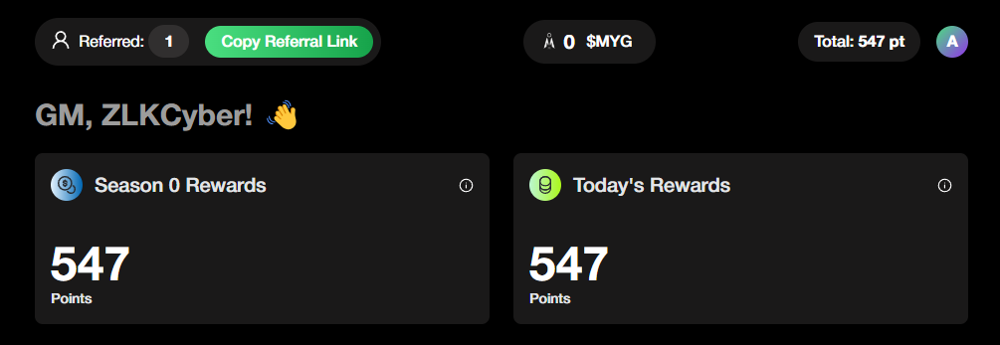
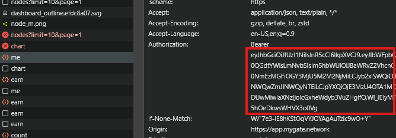

# MyGate Network Bot



## Features

- **Auto Generate Node ID**
- **Auto Connect/ping Node**
- **Auto Reconnect Node**

- **Support multiple accounts**
- **Support Proxy usage**
- **For Now Its Not Supported Creating Multiple Nodes for one account**

## Prerequisites

- Node.js installed on your machine
- `tokens.txt` file containing token my-gate platform follow instruction below to get:
- Open my-gate platform [https://mygate.network/](https://app.mygate.network/login?code=nnw2B3)
- Login With your gmail
- inspect or just F12, and find Network
- copy the token and save it in `tokens.txt` 

    !

## Installation

1. Clone the repository:
    ```sh
    git clone https://github.com/Zlkcyber/mygateBot.git
    cd mygateBot
    ```

2. Install the required dependencies:
    ```sh
    npm install
    ```
3. Input your token in `tokens.txt` file, one user per line;
    ```sh
    nano tokens.txt
    ```
4. optionally you can use proxy: 
- paste proxy in `proxy.txt` format `http://username:password@ip:port` 
    ```sh
    nano proxy.txt
    ```
5. Run the script:
    ```sh
    npm run start
    ```

## 

This project is licensed under the [MIT License](LICENSE).
